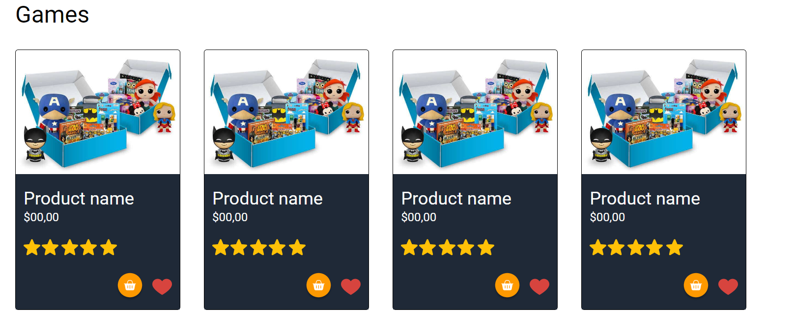

# Main CSS Assignment

## Table of contents
- [Overview](#overview)
  - [Page](#page)
  - [Instructions](#instructions)
  - [Template](#template)
- [Group](#group)
  - [Members](#members)
  - [Responsibilities](#responsibilities)

## Overview
### Page
Check out the project [here](https://noliv197.github.io/main-css-assignment/)
### Instructions
1. Recreate the page design as similar as possible. 
   * Use the information on font-size, font-weight, colors and background-colors provided 
2. The website must have 3 pages in total
3. Content of the website is up to the group
4. Make the website responsive and create a semantic HTML structure
5. Only basic HTML and CSS are allowed. __NO libraries, frameworks or SASS are allowed!__
* __Suggestions__: 
    * For the section you’re working on, begin by getting all the content onto the page before beginning to style it.
    * Take it one section at a time. The website you’re creating has 4 main sections (and a footer), so pick one and get it into pretty good shape before moving on. Starting at the top is always a solid plan.

### Template

## Group
### Members
|David Ghizzi|Natalia Oliveira|Nicola Dimant|Sharon Ettinger|William Bebiano|
|------------|----------------|-------------|---------------|--------------|
||||||
|[@daveiho](https://github.com/daveiho)|[@noliv197](https://github.com/noliv197)|[@Nicci12](https://github.com/Nicci12)|[@SharonEttinger](https://github.com/SharonEttinger)|[@WilliamBebiano](https://github.com/WilliamBebiano)|

### Responsibilities
#### David
  * categories section
  
  
  
  * products section
  
  

#### Natalia
  * project base
  * sign up page

#### Nicci
  * header section
  * banner section

#### Sharon
  * quote section
  * review section

#### William
  * footer section

* content
